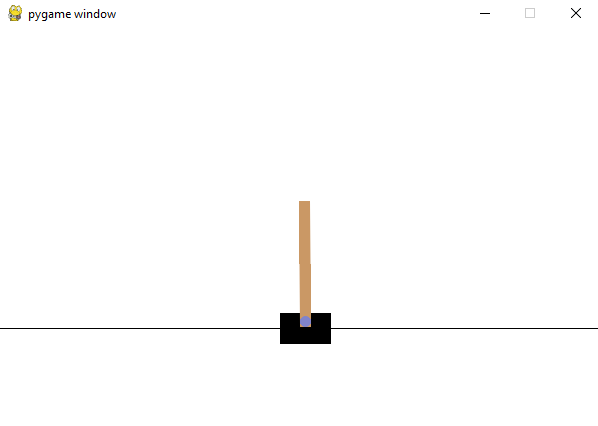
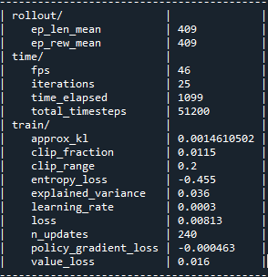

# cartpole_reinforcement_learning

This project focuses on training an agent to solve the classic CartPole balancing problem using Proximal Policy Optimization (PPO), a popular reinforcement learning algorithm.

## ⚖️ About CartPole Environment  

CartPole is a classic control problem where the goal is to balance a pole hinged on a moving cart by applying forces to the cart to keep the pole upright. It is widely used as a benchmark for reinforcement learning algorithms because it is simple to understand yet challenging enough to test learning capabilities.

The environment provides continuous observations (e.g., pole angle, cart position) and discrete actions (move cart left or right). The agent learns a policy to maximize cumulative rewards by balancing the pole as long as possible.

The episode ends if one of the following conditions is met:

* The pole angle exceeds ±15 degrees (approximately ±0.2618 radians).

* The episode length reaches 500 steps (maximum episode length limit).

  

Below is the terminal output after training:

